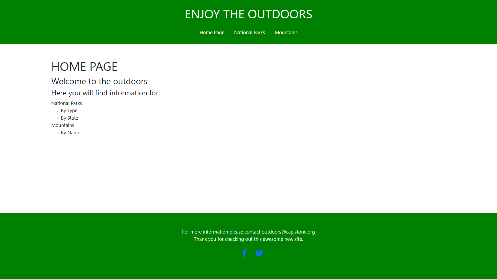

# CAPSTONE-2-OUTDOORS

Hello and welcome to my website for Enjoy the Outdoors

This is a simple example website with basic filter functions

There are two file directories within the Capstone 2 which link to the

/images
/scripts

There is a javascript file for each of the two arrays in National Parks and Mountains

National Park filters all parks in the array by State and then by Park Type 

Mountains finds a mountain by name and then returns that description

The Nav Bar links each page within the website to each other and it is a sticky bar, so when you scroll it will move with the browser 

Footer shows simple information about the company

Main section houses the content for each webpage

There are 3 web pages

Home Page = Index
National Parks Page
Mountains Page

Each webpage has responsive web design and it will resize to fit all the contents evenly within the viewort

  
  
  

